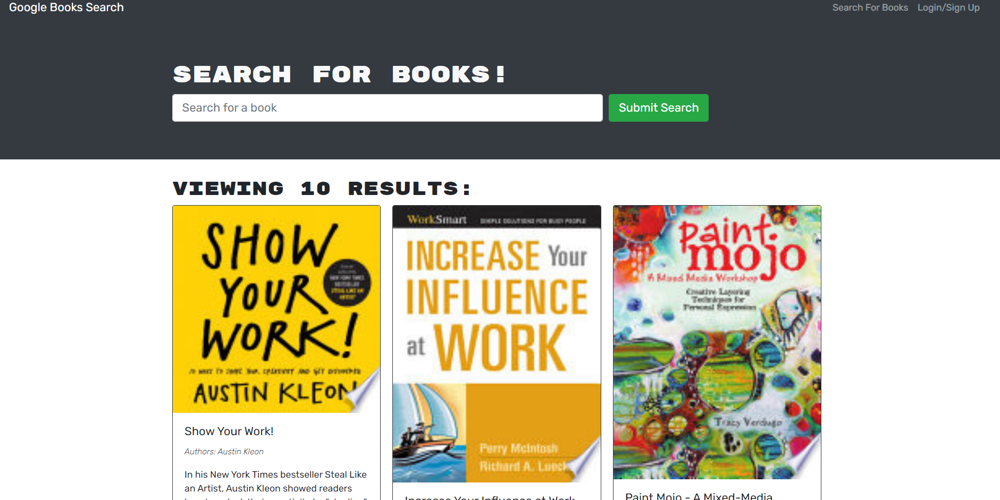
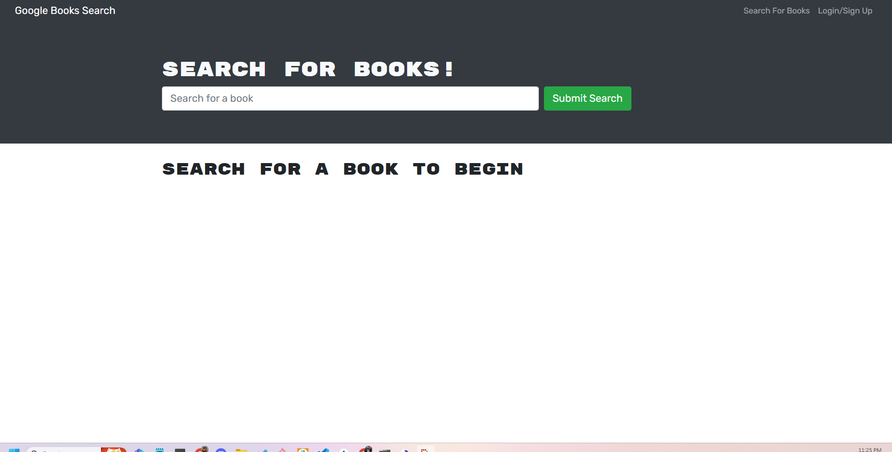

# Virtual Book Shelf

This is a full-stack application that allows users to manage a virtual bookshelf. Users can create accounts, add books to their bookshelves, and update or delete books as needed. The application uses a GraphQL API to fetch and modify data, and authentication is implemented using JSON Web Tokens (JWT).

## Technologies Used

- React.js
- Node.js
- Express.js
- Apollo Server
- GraphQL
- MongoDB
- Mongoose ODM
- JSON Web Tokens (JWT)
- Heroku

## Installation and Usage

To run this application locally, you will need to have Node.js and MongoDB installed on your system. Clone the repository and run the following commands:

npm install
npm run dev

This will start the development server and launch the application in your default browser at http://localhost:3000.

To build the application for deployment, run the following command:

npm run build

This will create a production build of the application in the `build` directory.

## Deployment

To deploy this application to Heroku, follow these steps:

1. Create a new Heroku app using the Heroku CLI or the Heroku Dashboard.
2. Set the `MONGODB_URI` environment variable to the MongoDB connection string for your database.
3. Set the `JWT_SECRET` environment variable to a secure random string.
4. Push the application to Heroku using Git or the Heroku CLI.

